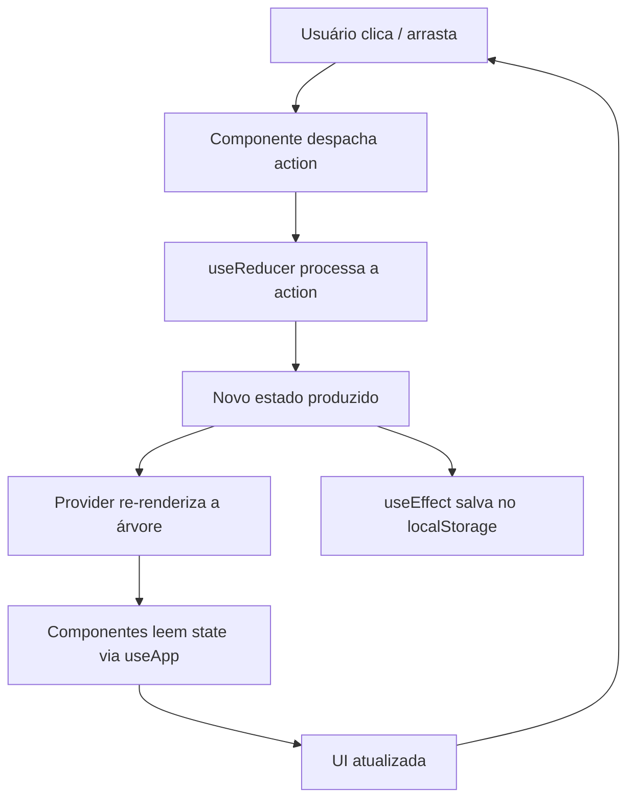

# GuildRun Team Builder Pro

Planejador de equipes para o jogo GuildRun (Leyline), com tabuleiro hexagonal interativo, sinergias de classe em tempo real, gerenciamento de itens e relíquias, estatísticas calculadas e exportação de builds em JSON. Projeto de fã com finalidade educacional, desenvolvido como estudo de migração de JavaScript puro para React.

## Visão geral

O planner resolve um problema prático do jogador de GuildRun: testar composições de equipe antes de entrar em combate. Nele é possível posicionar até 3 heróis titulares em um tabuleiro hexagonal de 26 células, mantendo outros 3 em reservas, distribuir 5 itens por personagem, adicionar relíquias globais e observar como as sinergias de classe e as estatísticas totais respondem a cada mudança — tudo recalculado instantaneamente.

A interface é organizada em três zonas visíveis simultaneamente no desktop: análise (sinergias, estatísticas e relíquias), arena central (tabuleiro hexagonal com equipamento do herói selecionado) e biblioteca de heróis (busca, filtros e cards).

## Funcionalidades

**Heróis e posicionamento**

- Biblioteca com os 25 heróis do jogo, com busca por nome e função, filtros por tier (S/A/B/C) e classe, e ordenação por tier ou nome.
- Tabuleiro hexagonal de 26 células (4 linhas em padrão favo de mel), onde cada célula corresponde a um índice do array de estado.
- Posicionamento por dois cliques: clique no herói da biblioteca, depois em um hexágono vazio.
- Movimentação por dois cliques: clique em um herói posicionado para selecioná-lo, clique de novo para pegá-lo, clique em outro hexágono para mover ou trocar de posição.
- Arrastar e soltar: da biblioteca direto para qualquer hexágono vazio, entre hexágonos ocupados (troca) e entre tabuleiro e reservas.
- Limite de 3 heróis ativos no tabuleiro; excedentes vão para a área de reservas (3 slots em painel lateral).
- Botões de mover (titular ↔ reserva) e remover em cada herói posicionado.

**Itens**

- 5 slots de itens por herói, gerenciados através de um seletor inline que abre ao clicar nos mini-itens do herói selecionado ou no painel de equipamento.
- Ícones reais do jogo para 163 dos 170 itens, com moldura colorida pela raridade.
- O seletor bloqueia itens já equipados em outro slot do mesmo herói.
- Clicar no item atual (destacado em verde) desequipa o item.

**Relíquias**

- Até 298 relíquias globais do time, gerenciadas num seletor inline com filtro por raridade.
- Ícones reais do jogo para 293 das 298 relíquias.
- Adição e remoção direto na lista equipada, com contador no cabeçalho do painel.

**Sinergias e estatísticas**

- Painel de sinergias mostra todas as classes presentes na composição, ativas ou não, com contagem de heróis, pontos de limiar (2/3/4), barra de progresso e dica de quantos heróis faltam para o próximo nível.
- Heróis híbridos (com classe secundária) contam para ambas as sinergias.
- Painel de estatísticas exibe o DPS estimado em destaque, seguido da grade de atributos somados (HP, ataque, defesa, magia, velocidade, crítico, mana etc.).
- Os valores refletem heróis + itens equipados + relíquias globais.

**Exportação e persistência**

- Exportação da build em JSON para a área de transferência, incluindo heróis, itens, relíquias, sinergias ativas, estatísticas e DPS.
- Salvamento automático no `localStorage` a cada mudança, com indicador visual de estado salvo no cabeçalho.
- Nome da composição editável no cabeçalho, persistido separadamente.
- Confirmação inline para limpar a composição (dois cliques no botão, sem diálogo nativo).

## Tecnologias

| Tecnologia | Uso |
|---|---|
| React 19 | Camada de interface, componentes funcionais com hooks |
| Vite 7 | Bundler e servidor de desenvolvimento |
| JavaScript (ES Modules) | Linguagem de toda a aplicação |
| Context API + `useReducer` | Estado global compartilhado, com toda a lógica de mutação centralizada em um reducer |
| CSS global | Um único arquivo de estilos (`src/index.css`) com custom properties para design tokens, sem frameworks CSS |
| HTML5 Drag and Drop | API nativa para arrastar heróis entre biblioteca, hexágonos e reservas |
| `localStorage` | Persistência da composição (`guildrun_pro`) e do nome da build (`guildrun_build_name`) |
| SVG inline | Ícones de classe renderizados por um componente React, sem dependência de fontes de ícones |
| `clip-path` CSS | Molduras hexagonais nos retratos dos heróis |

Não há dependências de UI, gerenciamento de estado ou drag-and-drop — apenas `react`, `react-dom`, `vite` e `@vitejs/plugin-react`.

## Arquitetura

A aplicação segue fluxo de dados unidirecional: os componentes despacham ações (`dispatch`), o reducer produz o novo estado, e a interface re-renderiza a partir do novo valor. Nenhum componente modifica estado diretamente.

**Estado global** — gerenciado por `AppContext` com `useReducer`. O reducer concentra toda a lógica de negócio: escalar herói, posicionar em hexágono específico, mover/trocar entre hexágonos, equipar/desequipar itens, adicionar/remover relíquias, filtrar a biblioteca e resetar a composição. O estado inclui também campos transitórios (`selectedCharId`, `placementCharId`, `placementFrom`) que não são persistidos.

**Estado local** — usado apenas para questões visuais de curta duração: o seletor de itens aberto (`useState` em `TeamGrid`), o estado de confirmação do botão Limpar (`useState` em `Header`), o indicador de "Salvo" (`useState` em `Header`), e o estado de hover de arraste (`useState` em cada `HexCell`).

**Dados estáticos** — um único arquivo (`src/data/data.js`) exporta os arrays de heróis, itens e relíquias, e a configuração de sinergias por classe. Nenhum componente altera esses dados.

**Utilitários** — funções puras que recebem o estado ou dados como parâmetros: `helpers.js` (busca por ID, contagens, verificação de time), `synergies.js` (cálculo de sinergias e análise de classes com limiares), `stats.js` (soma de atributos e cálculo de DPS), `exportBuild.js` (serialização e cópia para clipboard).

**Persistência** — um `useEffect` no `AppProvider` salva automaticamente o subconjunto persistido (`main`, `reserve`, `items`, `teamRelics`) no `localStorage` a cada mudança de estado. Na inicialização, `createInitialState()` carrega o estado salvo e expande o array `main` para o tamanho do tabuleiro (26 posições), com compatibilidade retroativa para saves antigas de 3 posições.

## Fluxo de dados



Ações do reducer despachadas pela interface:

- `SELECT_CHAR` — adiciona herói ao primeiro hexágono vazio (ou à reserva se o limite de 3 ativos foi atingido)
- `DROP_CHAR` — posiciona herói em um hexágono específico
- `SWAP_SLOTS` — move ou troca dois heróis entre quaisquer posições (hexágono ↔ hexágono, hexágono ↔ reserva)
- `SET_PLACEMENT_CHAR` / `CLEAR_PLACEMENT_CHAR` — gerencia o herói "pego" para posicionamento ou movimentação por dois cliques
- `SELECT_SLOT` — seleciona um herói posicionado (para visualizar itens)
- `SET_ITEM` / `REMOVE_ITEM` — equipa ou desequipa item em um slot
- `ADD_RELIC` / `REMOVE_RELIC` — adiciona ou remove relíquia global
- `SET_TIER_FILTER` / `SET_CLASS_FILTER` / `SET_SEARCH_QUERY` — filtros da biblioteca
- `RESET_TEAM` — limpa toda a composição

## Estrutura do projeto

```
src/
  main.jsx                     Entrada: renderiza App envolto pelo AppProvider
  App.jsx                      Layout de 3 colunas (análise / arena / biblioteca)
  index.css                    Folha de estilos global (design tokens + componentes)
  data/
    data.js                    HEROES_DATA, ITEMS_DATA, RELICS_DATA, SYNERGY_CONFIG
  context/
    AppContext.jsx             Context + Provider + persistência automática
    initialState.js            Estado inicial, expansão de saves, criação do time padrão
    reducer.js                 Todas as ações (posicionamento, itens, relíquias, filtros, reset)
  hooks/
    useApp.js                 useContext(AppContext)
    useLocalStorage.js         Hook genérico (disponível, não usado pelo estado principal)
  utils/
    helpers.js                 Busca por ID, contagens, verificação de time
    synergies.js               calculateSynergies, analyzeClassCounts (limiares 2/3/4)
    stats.js                   calculateTeamStats, calculateDPS
    exportBuild.js             Serialização JSON + clipboard
  components/
    Header.jsx                 Cabeçalho: nome da build, contagem, exportar, limpar
    ClassIcon.jsx              Ícones SVG das 7 classes
    SynergyPanel.jsx           Sinergias com limiares, dots e barra de progresso
    StatsPanel.jsx              DPS em destaque + grade de atributos
    HeroPool/                  Biblioteca: HeroPool, HeroCard, Filters
    Team/                      Tabuleiro: HexBoard, HexCell, TeamGrid, Equipment, MiniItems
    Items/                     Seletor de itens inline (ItemPicker)
    Relics/                    Lista e seletor de relíquias (RelicList, RelicItem)
public/assets/
    banner.webp                Banner oficial do jogo
    heroes/                    25 retratos de heróis
    items/                     163 ícones de itens
    relics/                    293 ícones de relíquias
```

## UX/UI e interação

**Layout de três colunas** — no desktop, a tela é dividida em análise (esquerda), arena central (tabuleiro hexagonal, equipamento e seletor de itens) e biblioteca (direita), todas visíveis simultaneamente com rolagem independente. Em telas menores, o layout muda para coluna única com a biblioteca recolhível.

**Tabuleiro hexagonal** — 26 células dispostas em 4 linhas escalonadas (7-6-7-6), com molduras hexagonais via `clip-path` CSS. Células vazias exibem contorno sutil de terreno com um "+" discreto. Células ocupadas mostram o retrato do herói com moldura dourada, nome sobreposto em gradiente, ícones de classe e mini-itens equipados.

**Posicionamento por dois cliques** — o usuário clica em um herói da biblioteca (o card fica com borda dourada pulsante), depois clica em um hexágono vazio (que pulsa em âmbar durante a seleção). Para mover um herói já posicionado: primeiro clique seleciona (mostra o painel de equipamento), segundo clique no mesmo herói o "pega" (eleva com pulso dourado), e o próximo clique em qualquer hexágono move ou troca de posição. A tecla `ESC` cancela o posicionamento a qualquer momento.

**Arrastar e soltar** — heróis podem ser arrastados da biblioteca direto para o tabuleiro, entre hexágonos (com troca de posições ao soltar em célula ocupada), do tabuleiro para as reservas e das reservas de volta ao tabuleiro.

**Feedback sem popups** — a aplicação não usa diálogos nativos, modais ou notificações flutuantes. Todas as confirmações e feedbacks são inline: o botão "Limpar" muda para "Confirmar limpeza?" no primeiro clique, o botão "Exportar" muda para "Copiado!" ao copiar, e o indicador "Salvo" pisca quando a persistência grava o estado.

**Seletor de itens inline** — ao clicar nos mini-itens do herói selecionado ou nos slots de equipamento, um painel seletor aparece abaixo do tabuleiro com a lista de 170 itens (ícone, nome, tipo, raridade e stats). O item equipado no slot atual é destacado em verde; clicar nele desequipa. Itens já equipados em outro slot aparecem esmaecidos e não são clicáveis.

**Painel de sinergias** — cada classe presente na composição tem sua própria linha com ícone SVG, contagem de heróis, pontos de limiar preenchidos (2/3/4), barra de progresso rumo ao próximo nível e texto de bônus ativo. Classes inativas mostram "+N para ativar".

**Equipamento do herói selecionado** — abaixo do tabuleiro, um painel mostra os 5 slots de itens do herói atualmente selecionado, com ícones reais, nome e moldura de raridade. Ao lado, o seletor de itens inline abre no slot clicado.

**Responsividade** — os hexágonos escalam via custom properties CSS (`--hex-w`, `--hex-h`) em três breakpoints: desktop (112×126px), tablet (90×102px) e mobile (46×52px). O layout muda de três colunas para uma coluna abaixo de 1180px.

## Dados e recursos visuais

**Stats dos heróis** — extraídos e validados contra a `HeroSheet` oficial do jogo via AssetRipper (build Demo 0.5.11), incluindo `class2` para heróis híbridos e `startingMana`. Os stats refletem os dados da build atual do jogo, não valores estimados.

**Classes e sinergias** — 7 classes (Warrior, Tank, Vanguard, Assassin, Duelist, Mystic, Mage) com limiares de ativação em 2, 3 e 4 heróis, conforme as regras do jogo. Os bônus por nível estão definidos em `SYNERGY_CONFIG` no arquivo de dados.

**Itens e relíquias** — 170 itens com stats por atributo e 298 relíquias com efeitos descritos. Os stats dos itens somam diretamente às estatísticas do time; os das relíquias são adicionados globalmente.

**Imagens** — 18 retratos de heróis extraídos dos assets do jogo via UnityPy; 7 fornecidos pelo autor do projeto (heróis sem arte na build atual da demo). 163 ícones de itens e 293 de relíquias também extraídos do jogo. O banner do cabeçalho é arte oficial fornecida pelo autor. Os ícones das 7 classes são SVGs próprios do projeto, renderizados via `ClassIcon.jsx`.

## Projeto de fã

Este é um projeto de fã, sem fins comerciais, com finalidade educacional. GuildRun e todos os seus recursos visuais pertencem à Leyline Creations GmbH. As imagens extraídas dos assets do jogo são usadas apenas neste planner local e não devem ser redistribuídas. O projeto não possui vínculo oficial com a Leyline.
